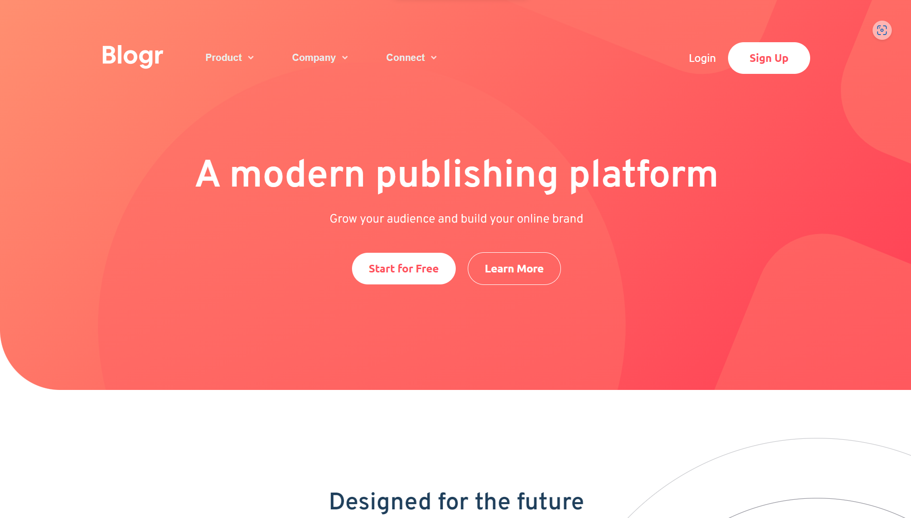

# Blogr

Blogr is a blogging website. This is the responsive landing page of Blogr which is build with Vanilla CSS and JS.

## Table of contents

- [Overview](#overview)
  - [The challenge](#the-challenge)
  - [Screenshot](#screenshot)
  - [Links](#links)
- [My process](#my-process)
  - [Built with](#built-with)
  - [What I learned](#what-i-learned)
- [Author](#author)
- [Note](#Note)

## Overview

### The challenge was

Users should be able to:

- View the optimal layout for the site depending on their device's screen size
- See hover states for all interactive elements on the page

### Screenshot

### Links

- Solution URL: [Add solution URL here](https://github.com/amittam104/Blogr)
- Live Site URL: [Add live site URL here](https://amittam104.github.io/Blogr/)

## My process

### Built with

- Semantic HTML5 markup
- CSS custom properties
- Flexbox
- CSS Grid
- Vanila JavaScript

### What I learned

I was able to brush up my vanilla CSS skills with this responsive design of Blogr.

## Author

- Twitter - [@attambulkar](https://twitter.com/attambulkar)

#### Note

This is a solution to the [Blogr landing page challenge on Frontend Mentor](https://www.frontendmentor.io/challenges/blogr-landing-page-EX2RLAApP). Frontend Mentor challenges help you improve your coding skills by building realistic projects.
